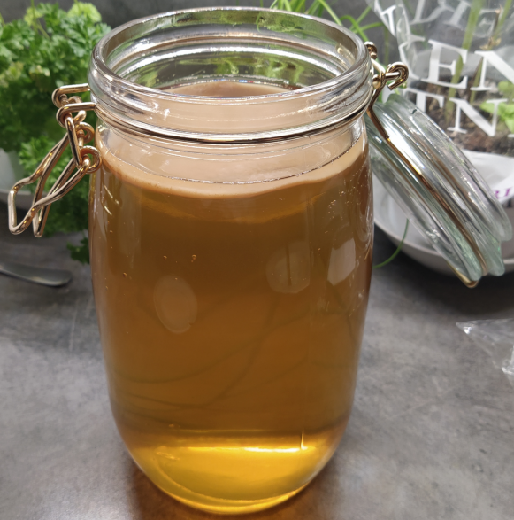
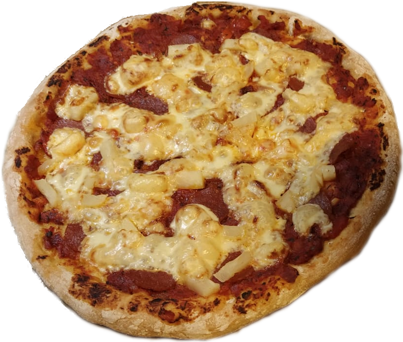

# Oppskrifter på ting vi syns er digg!

  
 • <a href="#kombucha">Kombucha</a> • <a href="#pizza">Pizza</a> • <a href="#ketchup">Ketchup</a>
  

## Kombucha:

<h3>
  
 
  
 </h3>
 
 

Kombucha er fermentert te. 
  
Friskt, godt og kjempe sundt!

### Ingredienser
1. Te
2. vann
3. sukker

### Slik gjør du

 

## Pizza:

<h3>
  

  
</h3>

Vår klassiske torsdags-pizza!

### Pizzadeigen (2 pizzaer):
* 500g mel (Helst hvetemel, men vi kjører spelt for å være litt sunnere)
* ca 1/3 pakke tørrgjær (kan erstattes med 10g fersk gjær)
* 5g salt
* 325ml vann (romtemperert. Bedre for kaldt enn for varmt)

### Pizzasausen
* 1/2 løk
* 6 hvitløksfedd (eller 1 kinesisk hvitløk)
* 3ss olivenolje
* 4ss tomatpurè
* 1 boks hakka tomater
* 3ts oregano
* 2ts timian
* 2ts basilikum
* salt og pepper
* Vi har også pleid å ha i safta fra 1 boks annanas

### Slik gjør du
1. Ha alle de tørre inngrediensene i en bolle. 
2. Ha i vann og miks det godt sammen. 
3. Hell deigen ut på benken og kna den i 10 minutter. Man kjenner den den blir digg og luftig. 
4. Dekk den til med håndklede eller plastfolie og la den heve i 30 minutter. 
 
Nå er en fin tid å starte på sausen:
1. Finhakk løk og hvitløk og stek dem gyldne i panna
2. Ha oppi tomatpurè og hakka tomater
3. Ha oppi krydderne og smak til med salt og pepper
4. La stå og småkoke til pizzadeigen er klar. 

Apropos deigen:
1. Når deigen har hevet i 30 minutter deles den i to. Dekk dem til igjen og la dem heve i 30 minutter til
2. Sett ovnen på 220 grader, så den er klar når du har dandert pizzaen
3. Form deigene til runde fine pizzaer 
4. Ha på pizzasaus og ønsket topping. Personlig favoritt er pepperoni, annanas og ost 
5. Stekes i ca 8-10 minutter. 
6. Nyt <3

 

## Ketchup:
1. Tomater
2. honning
3. hvitløk

 

